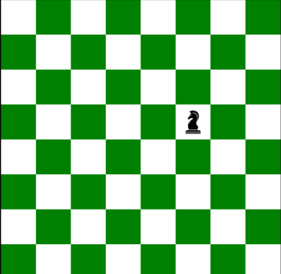

# Knights-tour-visualizer

# INTRO
This project demonstrates how backtracking actually works . This project is built using python turtle module.

Place the knight on any part of the board it will show the complete visual representation of its tour.

 

For better understanding look at the attached images.

The turtle module creates an 8 X 8 chess board with

 
 
 

Place the knight at any position , this is the starting point of the knight.
 
 
 

 
 
 
Knights tour starts and it visits all the adjacent nodes
 
 
 

 
 
 

Whenever it it doesn't find any adjacent places it backtracks,until it finishes all the positions
 
 
 

 
 
 

#Fun Fact
 
On an 8 × 8 board, there are exactly 26,534,728,821,064 directed closed tours (i.e. two tours along the same path that travel in opposite directions are counted separately, as are rotations and reflections). The number of undirected closed tours is half this number, since every tour can be traced in reverse!

